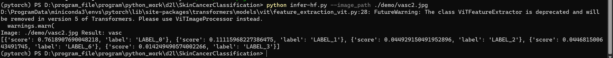
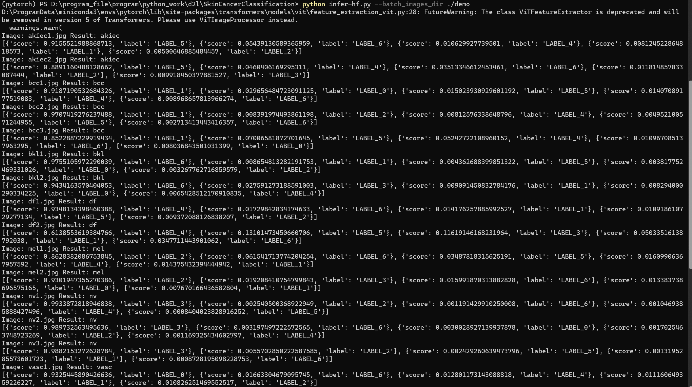

# Skin_Cancer_Classification
皮肤癌分类任务，采用HAM10000数据集，总共7个类别
## Train-hf.py

这是一个用于训练图像分类模型的代码。在运行代码之前，用户需要安装以下依赖库：argparse, os, pandas, numpy, PIL, datasets, torchvision, tqdm和transformers。用户还需要从Hugging Face上下载所需的预训练模型。

### 参数说明

- `--metadata_path`：metadata文件的路径。默认为"./archive/HAM10000_metadata.csv"。
- `--images_dir`：图像文件夹的路径。默认为"./archive/HAM10000_images/"。
- `--model_dir`：预训练模型的路径。默认为"../model/vit-large-patch16-224-in21k"。
- `--checkpoints_dir`：保存检查点文件的文件夹路径。默认为"./checkpoints"。
- `--learning_rate`：学习率。默认为1e-5。
- `--batch_size`：批大小。默认为64。
- `--epochs`：训练轮数。默认为5。
- `--warmup_ratio`：预热步骤的比例。默认为0.1。
- `--split`：训练-验证数据集的分割比例。默认为0.8。
- `--gpu`：指定使用哪张GPU。默认为"0"。
- `--logging_steps`：每隔多少步记录一次训练日志。默认为50。

用户可以在命令行中传递这些参数，例如：
```shell
    python train-hf.py --metadata_path ./archive/HAM4000_metadata.csv \
                       --images_dir ./archive/HAM10000_images/ \
                       --checkpoints_dir ./checkpoints \
                       --learning_rate 1e-4 \
                       --batch_size 64 \
                       --epochs 20 \
                       --warmup_ratio 0.1 \
                       --model_dir ../model/vit-large-patch16-224-in21k \
                       --gpu 5,6,7 \
                       --logging_steps 1
```
在代码运行过程中，会执行以下步骤：

1. 读取metadata文件，获取图像文件名和标签。
2. 将图像读入内存，并随机打乱。
3. 将数据集划分为训练集和验证集。
4. 对图像进行预处理，包括随机裁剪、归一化和转换为tensor。
5. 加载预训练模型，构建分类器。
6. 训练模型，并在验证集上评估模型性能。
7. 在训练过程中，每隔logging_steps步记录一次训练日志，包括损失值、准确率等指标。
8. 在训练结束后，保存模型的权重文件到checkpoints_dir文件夹中。


## Infer-hf.py
这个Python脚本是一个基于Transformers库的图像分类推理模型，能够对单张或批量的图像进行分类预测。使用该脚本需要在命令行中指定相关参数。
### 参数说明
`--image_path`：指定单张图片的路径，例如 `--image_path ./test.jpg` 默认为`None` 

`--model_dir`：指定预训练模型的路径，例如`--model_dir ./checkpoints/vit-large-91`默认`./checkpoints/vit-large-91`

`--batch_images_dir`：指定需要批量预测的图片所在文件夹的路径，例如`--batch_images_dir ./batch_images`默认为`None
`
### 输出说明
在脚本运行时，会先根据指定的预训练模型构建一个图像分类推理模型。接下来，如果指定了`--image_path`则会对该路径下的单张图片进行预测，输出预测结果和置信度。如果指定了`--batch_images_dir`
则会对该文件夹下的所有图片进行批量预测，输出每张图片的预测结果和置信度。
### 使用示例
1. 对单张图片进行预测：
    ```shell
      python infer-hf.py --image_path ./test.jpg --model_dir ./checkpoints/vit-large-91
    ```
   
2. 夹下的所有图片进行批量预测：
    ```shell
      python infer-hf.py --batch_images_dir ./batch_images --model_dir ./checkpoints/vit-large-91
    ```
   

## Test-hf.py
对测试集进行测试，修改超参数Run一下即可，小心爆显存，实测3060laptop batch_size 200以内没问题
